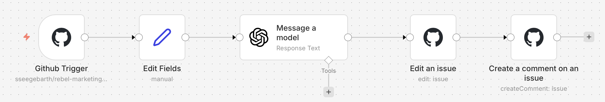

# Use Case 2: Smart Issue Triage – KI-gestützte Issue-Analyse

## Was bauen wir?

Einen Workflow, der automatisch auf neue GitHub Issues reagiert. Eine KI analysiert jedes Issue, ordnet es ein (Bug, Feature, Frage) und postet die Analyse als Kommentar zurück ins Issue.

## Workflow-Übersicht


```
Neues Issue → Felder extrahieren → KI-Analyse → Labels setzen → Kommentar posten
```

---

## Schritt 1: Workflow erstellen (2 Min.)

1. Klicke auf **Add Workflow**
2. Benenne den Workflow: **"Smart Issue Triage"**

---

## Schritt 2: GitHub Trigger einrichten (8 Min.)

1. Klicke auf **+** → suche nach **GitHub Trigger**
2. Konfiguriere:

| Feld | Wert |
|------|------|
| **Credential** | *(deine GitHub-Credentials)* |
| **Repository Owner** | *(dein GitHub-Username)* |
| **Repository Name** | *(dein Workshop-Repo)* |
| **Events** | `issues` |

> ⚠️ Falls der Repository Owner nicht angezeigt wird: Wechsel von "From list" auf "Expression" und trage deinen Username direkt als Text ein.

3. Klicke auf **Test Step** – n8n wartet jetzt auf ein Event
4. Erstelle ein neues Issue in deinem GitHub-Repo:
   - Titel: `Login-Seite gibt 500 Fehler bei falschen Zugangsdaten`
   - Body: `Wenn man ein falsches Passwort eingibt, kommt ein 500 Internal Server Error.`
5. n8n sollte die Issue-Daten empfangen

---

## Schritt 3: Felder extrahieren (5 Min.)

1. Füge einen **Edit Fields** (Set) Node hinzu
2. Erstelle diese Felder:

| Feld-Name | Wert |
|-----------|------|
| `issue_nummer` | `{{ $json.body.issue.number }}` |
| `issue_titel` | `{{ $json.body.issue.title }}` |
| `issue_beschreibung` | `{{ $json.body.issue.body }}` |
| `issue_url` | `{{ $json.body.issue.html_url }}` |
| `issue_autor` | `{{ $json.body.issue.user.login }}` |

3. Klicke auf **Test Step**

**Benenne den Node um:** **"Felder extrahieren"**

> 💡 **Warum dieser Schritt?** Statt überall `$json.body.issue.title` zu schreiben, haben wir jetzt saubere Variablen wie `issue_titel`. Das ist lesbarer und weniger fehleranfällig.

---

## Schritt 4: KI-Analyse konfigurieren (12 Min.)

1. Füge einen **OpenAI** Node hinzu
2. Konfiguriere:

| Feld | Wert |
|------|------|
| **Resource** | Message |
| **Operation** | Send |
| **Model** | `gpt-4o-mini` |

> ⚠️ **Wichtig:** Nur `gpt-4o-mini` unterstützt das JSON-Schema Format. Nicht `gpt-4-turbo`!

3. **System Message:**

```
Du bist ein erfahrener Software-Projektmanager. Analysiere das folgende GitHub Issue und antworte AUSSCHLIESSLICH mit einem JSON-Objekt (kein Markdown, kein Text drumherum):

{
  "kategorie": "bug" | "feature" | "frage" | "dokumentation",
  "prioritaet": "hoch" | "mittel" | "niedrig",
  "zusammenfassung": "Ein Satz, der das Issue beschreibt",
  "begruendung": "Warum diese Kategorie und Priorität?",
  "empfehlung": "Was sollte das Team als nächstes tun?"
}

Regeln für die Priorisierung:
- hoch: Sicherheitsprobleme, Datenverlust, Produktionsausfälle
- mittel: Funktionale Bugs, blockierende fehlende Features
- niedrig: Kosmetik, Nice-to-have, Dokumentationswünsche
```

4. **User Message:**

```
Issue-Titel: {{ $json.issue_titel }}

Issue-Beschreibung:
{{ $json.issue_beschreibung }}
```

5. **Response Format** → **JSON Schema** mit folgendem Schema:

```json
{
  "type": "object",
  "properties": {
    "kategorie": {
      "type": "string",
      "enum": ["bug", "feature", "frage", "dokumentation"]
    },
    "prioritaet": {
      "type": "string",
      "enum": ["hoch", "mittel", "niedrig"]
    },
    "zusammenfassung": {
      "type": "string",
      "description": "Ein Satz, der das Issue beschreibt"
    },
    "begruendung": {
      "type": "string",
      "description": "Warum diese Kategorie und Priorität?"
    },
    "empfehlung": {
      "type": "string",
      "description": "Was sollte das Team als nächstes tun?"
    }
  },
  "required": ["kategorie", "prioritaet", "zusammenfassung", "begruendung", "empfehlung"],
  "additionalProperties": false
}
```

> ⚠️ **Wichtig:** `"additionalProperties": false` darf nicht fehlen, sonst gibt OpenAI einen Fehler!

6. Klicke auf **Test Step**

**Benenne den Node um:** **"Issue analysieren"**

---

## Schritt 5: Labels setzen (8 Min.)

1. Füge einen **GitHub** Node hinzu
2. Konfiguriere:

| Feld | Wert |
|------|------|
| **Credential** | GitHub Workshop |
| **Resource** | Issue |
| **Operation** | Edit |
| **Repository Owner** | *(dein GitHub-Username)* |
| **Repository Name** | *(dein Workshop-Repo)* |
| **Issue Number** | `{{ $('Felder extrahieren').item.json.issue_nummer }}` |
| **Labels** | `{{ $json.output[0].content[0].text.kategorie }},prio-{{ $json.output[0].content[0].text.prioritaet }}` |

> ⚠️ **Wichtig:** Die Labels müssen im Repository existieren! Wenn du dieses Repo geforkt hast, sind sie schon da.

3. Klicke auf **Test Step** und prüfe in GitHub ob die Labels gesetzt wurden

**Benenne den Node um:** **"Labels setzen"**

---

## Schritt 6: Analyse-Kommentar posten (8 Min.)

1. Füge einen weiteren **GitHub** Node hinzu
2. Konfiguriere:

| Feld | Wert |
|------|------|
| **Credential** | GitHub Workshop |
| **Resource** | Issue |
| **Operation** | Create Comment |
| **Repository Owner** | *(dein GitHub-Username)* |
| **Repository Name** | *(dein Workshop-Repo)* |
| **Issue Number** | `{{ $('Felder extrahieren').item.json.issue_nummer }}` |

3. **Body:**

```
🤖 **Automatische Issue-Analyse**

**Issue:** [#{{ $('Felder extrahieren').item.json.issue_nummer }} – {{ $('Felder extrahieren').item.json.issue_titel }}]({{ $('Felder extrahieren').item.json.issue_url }})

| | |
|---|---|
| **Kategorie** | {{ $('Issue analysieren').item.json.output[0].content[0].text.kategorie }} |
| **Priorität** | {{ $('Issue analysieren').item.json.output[0].content[0].text.prioritaet }} |
| **Zusammenfassung** | {{ $('Issue analysieren').item.json.output[0].content[0].text.zusammenfassung }} |

**Begründung:** {{ $('Issue analysieren').item.json.output[0].content[0].text.begruendung }}

**Empfehlung:** {{ $('Issue analysieren').item.json.output[0].content[0].text.empfehlung }}

---
*Diese Analyse wurde automatisch erstellt.*
```

4. Klicke auf **Test Step** und prüfe den Kommentar in GitHub

**Benenne den Node um:** **"Analyse posten"**

---

## Schritt 7: Live-Test (10 Min.)

1. Aktiviere den Workflow: Toggle oben rechts auf **Active**
2. Erstelle verschiedene Issues in GitHub:

**Test 1 – Bug, hohe Priorität:**
> Titel: Datenbankverbindung bricht nach 10 Minuten ab
> Body: Alle Nutzer sind betroffen. Die Anwendung verliert die DB-Verbindung und es gehen Bestellungen verloren.

**Test 2 – Feature, niedrige Priorität:**
> Titel: Dark Mode für das Dashboard
> Body: Es wäre schön, wenn das Dashboard einen Dark Mode hätte.

**Test 3 – Mehrdeutig:**
> Titel: Performance Problem
> Body: Die Seite ist manchmal langsam.

**Test 4 – Sicherheit:**
> Titel: Passwörter werden im Klartext geloggt
> Body: Im Server-Log tauchen die Passwörter der Nutzer im Klartext auf.

3. Vergleiche die Ergebnisse mit deinem Nachbarn!

---

## Troubleshooting

| Problem | Lösung |
|---------|--------|
| Trigger löst nicht aus | Workflow muss auf **Active** stehen (Toggle oben rechts) |
| Repository Owner leer | Wechsel auf "Expression" und Username direkt eingeben |
| "Model not found" | `gpt-4o-mini` wählen, nicht `gpt-4-turbo` |
| "additionalProperties" Fehler | `"additionalProperties": false` im JSON Schema ergänzen |
| Labels werden nicht gesetzt | Labels müssen im Repo existieren (Settings → Labels) |
| Webhook nicht erstellt | Token braucht Scope `admin:repo_hook` |
| Node-Namen stimmen nicht | Die Namen in `$('...')` müssen exakt den Node-Namen entsprechen |

---

## Bonus-Aufgaben

1. Füge einen IF-Node hinzu: Bei `prio-hoch` zusätzlich eine Slack-Nachricht senden
2. Erweitere den Prompt um Sprache-Erkennung (Deutsch/Englisch)
3. Experimentiere mit dem Prompt – wie verbesserst du die Trefferquote bei mehrdeutigen Issues?
